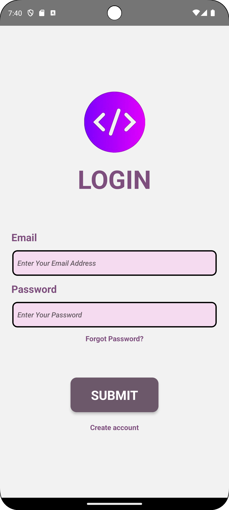
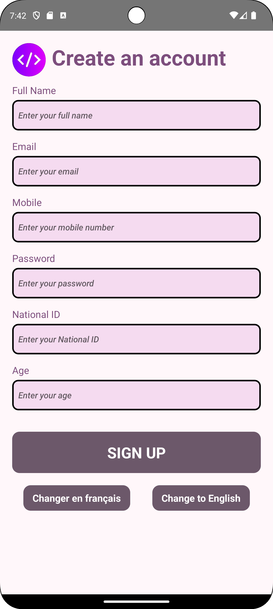
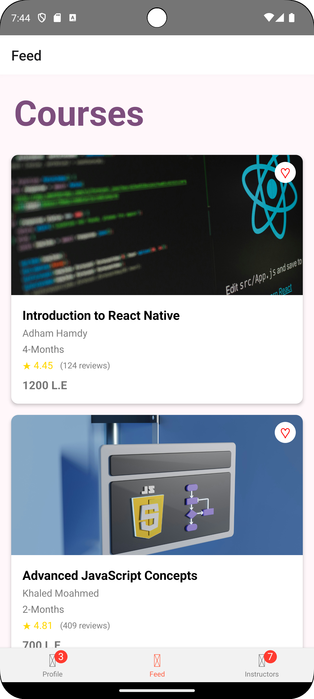
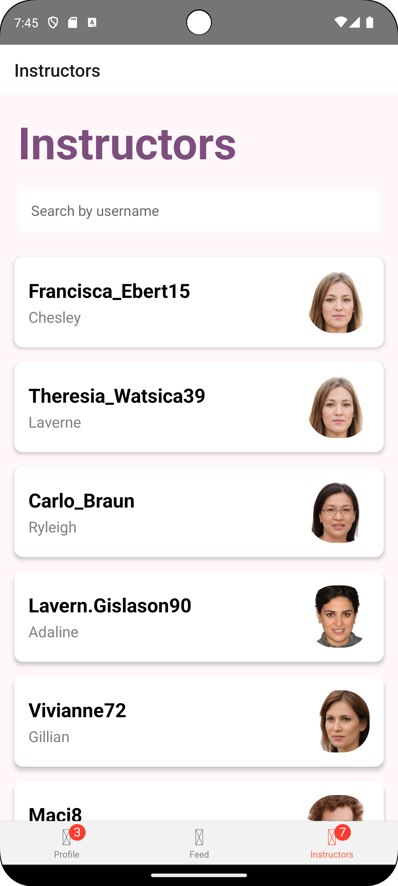

# Daily Dev

Daily Dev is an educational mobile application designed to showcase tech courses and instructors. It provides a platform for users to explore various technology fields and potential learning opportunities.

## Features

- User authentication (Login/Register)
- Course browsing
- User profile view
- Instructor directory

## Screens

### 1. Login Screen

- Email and password input
- Login button
- "Forgot Password?" link
- "Create account" link

### 2. Registration Screen

- Fields for full name, email, mobile number, password, national ID, and age
- Sign Up button
- Language toggle (English/French)

### 3. User Profile

- Display user information (username, profile picture)
- Show following, liked, and followers counts
- List courses (static display)
- Static "Courses" and "Settings" buttons

### 4. Course Feed

- Browse available courses
- Course cards with details (title, instructor, duration, rating, price)
- Like/favorite course option (visual only)

### 5. Instructors List

- Search instructors by username
- Display instructor profiles with profile pictures

## Current Functionality

- User Authentication: Implements login and registration processes
- Course Discovery: Allows users to view available tech courses
- Profile View: Users can view a static representation of their profile
- Instructor Directory: Provides a searchable list of course instructors
- API Integration: Fetches course and instructor data from a backend server

## Limitations

- Course enrollment is not currently implemented
- Profile buttons ("Courses" and "Settings") are static and non-functional
- Liking courses is visual only and does not affect the backend

## Technical Notes

- Built using React Native for cross-platform compatibility
- Implements scrolling for course and instructor lists
- Uses API calls to fetch instructor information

Daily Dev is a prototype showcasing the potential for an educational platform in the tech space. Future iterations aim to include full course enrollment functionality and interactive profile features.
